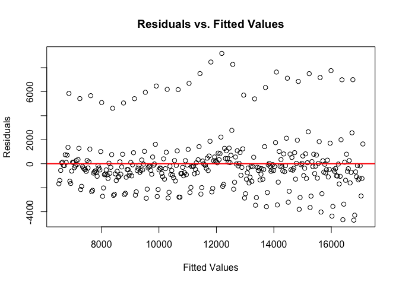
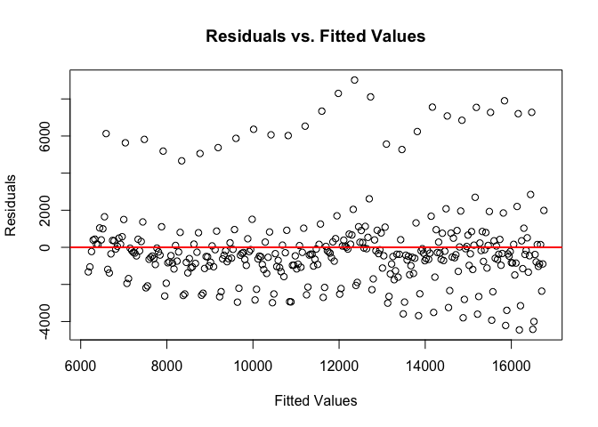
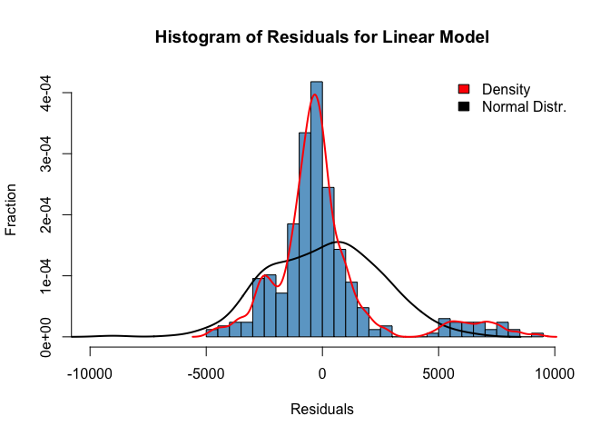
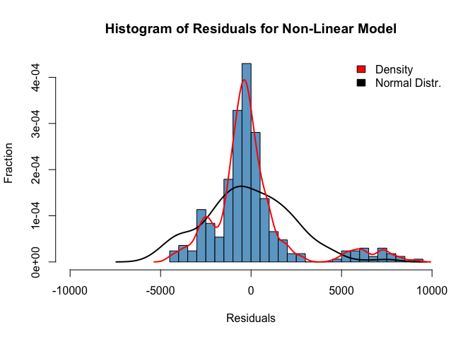
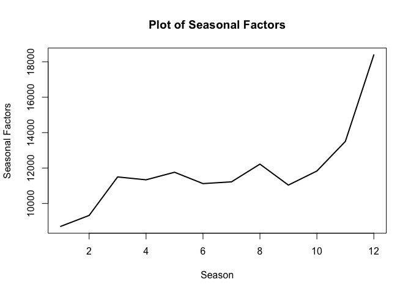
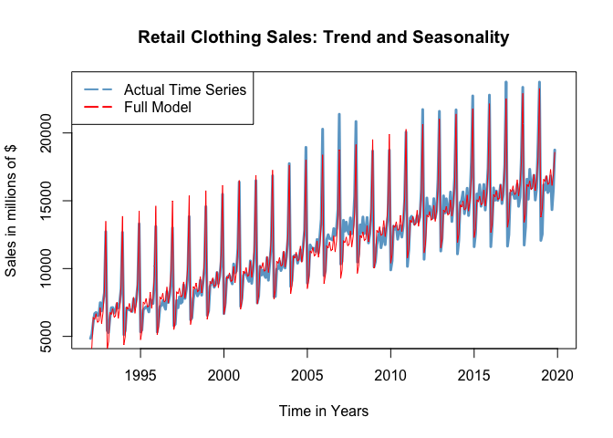
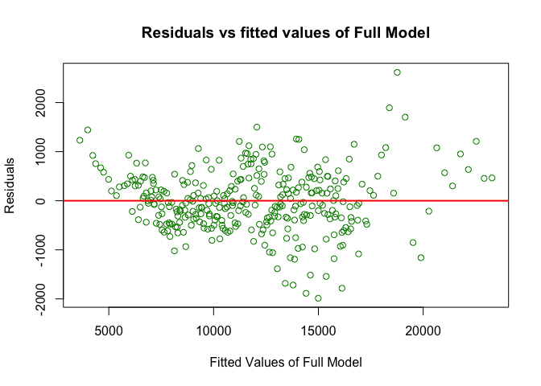

Forecasting US Monthly Clothing Sales
================
Theo Siouffi
1/27/2020

## Introduction

The data our group chose to analyze is the time series of monthly retail
sales from clothing stores. The frequency of this series is monthly,
reported at the first of every month from 1992-01-01 to 2019-11-01. The
unit of the Sales are in millions of dollars. The data is collected by
the U.S. Census Bureau, and retrieved from FRED, the Federal Reserve
Bank of St. Louis. It is not seasonally adjusted or transformed.

## Part I: Exploratory Analysis and Trend Model

### Library and Data Load

``` r
# Install and Load Libraries

library(tseries)
library(zoo)
library(car)
library(forecast)
require(stats)
library(vars)
library(tseries, quietly = T)
library(forecast, quietly = T)
library(foreign)
library(MASS)
require(stats4)
library(KernSmooth)
library(fastICA)
library(cluster)
library(leaps)
library(mgcv)
library(rpart)
require("datasets")
require(graphics)
library(RColorBrewer)
library(dplyr)
library(utils)
library(ggplot2)


#-----use following package to install and load above packages
#-----------------------------

#(install.packages("pacman")
#pacman::p_load(zoo, PerformanceAnalytics, quantmod, car, FinTS, fOptions, forecast, stats, vars, tseries, fBasics, timsac, TTR, lattice, foreign, MASS, KernSmooth, fastICA, cluster, leaps, mgcv, rpart, dplyr, RColorBrewer, datasets, graphics)

#-----------------------------

#-----Format Data

retail <- read.csv('/Users/theosiouffi/Google Drive (theosiouffi@g.ucla.edu)/UCLA/3rd Year/Winter 2020/Econ 144/Project/retail clothing.csv')
retail <- retail %>% rename(Sales = MRTSSM4481USN)
```

### Time Series Plot

``` r
#construct time series
sales_ts <- ts(retail$Sales, start = 1992, frequency = 12)
t<-seq(1992, 2020,length=length(sales_ts))
#plot time series
plot(sales_ts,type="l",col="skyblue3",lwd=2,main="Retail clothing sales",xlab="Years",ylab="Millions of dollars")
abline(h = mean(sales_ts), col = "red")
legend(x="topleft",legend=c("Clothing sales", "Mean Sales"),lty=1,lwd=2,col=c("skyblue3","red"))
```

<!-- -->

From the above plot, we hypthosize that the data is somewhat covariance
stationary. The variance can nearly be considered constant, and the data
reverts to its mean numerous times.

### ACF and PCF plots

``` r
#acf
Acf(sales_ts,main="ACF of Retail Clothing Sales", lag.max = 36, xlim = c(0,36))
```

<!-- -->

``` r
#pacf
Pacf(sales_ts,main="PACF of Retail Clothing Sales", lag.max = 36, xlim = c(0,36))
```

<!-- -->

In the ACF plot, we observe strong correlation among the observations of
the time series, even for a large lag (beyond 36). The spikes are well
beyond the confidence interval. Over time, these tend towards 0. In the
PACF, we observe that the observations seem to be less serially
correlated over time than the ACF had suggested. The spikes beyond the
confidence interval reduce to zero beyond the lag of 24 (in this dataset
this would be a year). The spikes are largest for a lag of 12, implying
that an observation (month) is most highly correlated with the same
month a year prior. This suggests that the data could be seasonal.

### Non-linear and linear model

``` r
#Linear fitting
m1 = tslm(sales_ts ~ t)

#Quadratic Fit
m2 = tslm(sales_ts~t+I(t^2))

#Plot Comparison
plot(sales_ts,ylab="Retail Clothing Sales", xlab="Time", lwd=1, col='skyblue3', xlim=c(1992,2020))
lines(t,m1$fit,col="red3",lwd=1)
lines(t,m2$fit,col="blue3",lwd=1)
legend(x="topleft",legend=c("Linear Fit", "Quadratic Fit"),lty=1,lwd=2,col=c("skyblue3","red"))
```

<!-- -->

### Residuals vs fitted values

``` r
plot(m1$fit,m1$res, xlab="Fitted Values",ylab="Residuals",main="Residuals vs. Fitted Values")
abline(h=0,lwd=2,col="red")
```

<!-- -->

``` r
plot(m2$fit,m2$res, xlab="Fitted Values",ylab="Residuals",main="Residuals vs. Fitted Values")
abline(h=0,lwd=2,col="red")
```

<!-- -->

The above plots hint that our models are not completely adequate for
this dataset. They are a number of outliers that aren’t captured by the
linear and quadratic models constructed in question d). In order to
capture these outliers, we should consider adding a seasonal component
to the model. Additionally, we notice a pattern to the residuals which
implies added factors could benefit the accuracy of the model. The
expectation of the residuals seem to revolve around 0 which suggests
that our models are somewhat adequate.

### Histogram of residuals

``` r
hist(m1$res, col="skyblue3",breaks = "FD",xlab="Residuals", ylab="Fraction",main="Histogram of Residuals for Linear Model", freq = FALSE, xlim=c(-10000,10000))
xr=rnorm(t, mean(m1$res),sd(m1$res))
lines(density(xr),col="black",lwd=2)
lines(density(m1$res),col="red",lwd=2)
legend(x = "topright",c("Density","Normal Distr."),fill=c("red","black"),bty='n')
```

<!-- -->

``` r
hist(m2$res, col="skyblue3",breaks = "FD",xlab="Residuals", ylab="Fraction", main="Histogram of Residuals for Non-Linear Model", freq = FALSE, xlim=c(-10000,10000))
x2r=rnorm(t,mean(m2$res),sd(m2$res))
lines(density(x2r),col="black",lwd=2)
lines(density(m2$res),col="red",lwd=2)
legend(x = "topright",c("Density","Normal Distr."),fill=c("red","black"),bty='n')
```

<!-- -->

Both histograms are identical, and neither seem to suggest either models
are a good fit to our data. Two groups of outliers scew the distribution
of the residuals away from a normal distribution. The first group is
clumped around 2500, which we hypothesize to be due to the models not
capturing the downward trend of the 2008 recession. For the second group
of outliers, the models might not be able to capture the high upswing
for last quarters of the year.

### Summary Statistics

``` r
summary(m1)
```

    ## 
    ## Call:
    ## tslm(formula = sales_ts ~ t)
    ## 
    ## Residuals:
    ##     Min      1Q  Median      3Q     Max 
    ## -4705.5 -1046.8  -354.6   347.9  9189.8 
    ## 
    ## Coefficients:
    ##               Estimate Std. Error t value Pr(>|t|)    
    ## (Intercept) -746203.92   31587.55  -23.62   <2e-16 ***
    ## t               377.87      15.75   24.00   <2e-16 ***
    ## ---
    ## Signif. codes:  0 '***' 0.001 '**' 0.01 '*' 0.05 '.' 0.1 ' ' 1
    ## 
    ## Residual standard error: 2337 on 333 degrees of freedom
    ## Multiple R-squared:  0.6336, Adjusted R-squared:  0.6325 
    ## F-statistic: 575.9 on 1 and 333 DF,  p-value: < 2.2e-16

``` r
summary(m2)
```

    ## 
    ## Call:
    ## tslm(formula = sales_ts ~ t + I(t^2))
    ## 
    ## Residuals:
    ##     Min      1Q  Median      3Q     Max 
    ## -4451.2 -1030.8  -349.6   399.9  9019.3 
    ## 
    ## Coefficients:
    ##               Estimate Std. Error t value Pr(>|t|)
    ## (Intercept) -1.135e+07  8.732e+06  -1.300    0.195
    ## t            1.095e+04  8.706e+03   1.258    0.209
    ## I(t^2)      -2.635e+00  2.170e+00  -1.214    0.226
    ## 
    ## Residual standard error: 2335 on 332 degrees of freedom
    ## Multiple R-squared:  0.6352, Adjusted R-squared:  0.633 
    ## F-statistic: 289.1 on 2 and 332 DF,  p-value: < 2.2e-16

The R-squared statistic for both models are identical. The F-stat for
the linear model is much higher than the F-stat for the quadratic model
and both are higher than the critical value. However, the t-stat for the
linear model is much higher, suggesting that its coefficients are
statistically more significant than the coefficients in the quadratic
model. Moreover, the p-values of the quadratic model’s coefficients are
high (&gt;0.05) suggesting that the coefficients are not statistically
significant and could be equal to 0.

### AIC, BIC

``` r
AIC(m1,m2)
```

    ##    df      AIC
    ## m1  3 6151.480
    ## m2  4 6151.996

``` r
BIC(m1,m2)
```

    ##    df      BIC
    ## m1  3 6162.922
    ## m2  4 6167.252

Both AIC and BIC values are lower for the linear model (m1). From the
previous questions, the linear model seems to the best fit for our data.
The residuals were identical, but the diagnostic statistics, AIC, and
BIC were in favor of the linear model.

### Forecast with Trend Model

``` r
tn=data.frame(t=seq(2019.917,2022, by = 1/12))
predm1=predict(m1, tn, interval  = "prediction")
predm1
```

    ##         fit      lwr      upr
    ## 1  17067.88 12444.71 21691.06
    ## 2  17099.37 12475.95 21722.79
    ## 3  17130.86 12507.20 21754.52
    ## 4  17162.35 12538.45 21786.26
    ## 5  17193.84 12569.69 21817.99
    ## 6  17225.33 12600.93 21849.73
    ## 7  17256.82 12632.17 21881.47
    ## 8  17288.31 12663.41 21913.21
    ## 9  17319.80 12694.65 21944.95
    ## 10 17351.29 12725.89 21976.69
    ## 11 17382.78 12757.12 22008.43
    ## 12 17414.27 12788.36 22040.18
    ## 13 17445.76 12819.59 22071.92
    ## 14 17477.25 12850.82 22103.67
    ## 15 17508.74 12882.05 22135.42
    ## 16 17540.22 12913.28 22167.17
    ## 17 17571.71 12944.50 22198.92
    ## 18 17603.20 12975.73 22230.68
    ## 19 17634.69 13006.95 22262.43
    ## 20 17666.18 13038.17 22294.19
    ## 21 17697.67 13069.40 22325.95
    ## 22 17729.16 13100.62 22357.71
    ## 23 17760.65 13131.83 22389.47
    ## 24 17792.14 13163.05 22421.23
    ## 25 17823.63 13194.26 22452.99

## Part II: Seasonality and Forecasting

### Seasonal Model

``` r
y_s=tslm(sales_ts ~ season)
summary(y_s)
```

    ## 
    ## Call:
    ## tslm(formula = sales_ts ~ season)
    ## 
    ## Residuals:
    ##    Min     1Q Median     3Q    Max 
    ##  -5714  -2872    347   2907   5793 
    ## 
    ## Coefficients:
    ##             Estimate Std. Error t value Pr(>|t|)    
    ## (Intercept)   8706.6      596.5  14.597  < 2e-16 ***
    ## season2        617.4      843.6   0.732 0.464736    
    ## season3       2790.9      843.6   3.308 0.001044 ** 
    ## season4       2628.1      843.6   3.115 0.002001 ** 
    ## season5       3055.9      843.6   3.623 0.000339 ***
    ## season6       2414.6      843.6   2.862 0.004479 ** 
    ## season7       2513.5      843.6   2.980 0.003105 ** 
    ## season8       3514.7      843.6   4.167 3.97e-05 ***
    ## season9       2330.9      843.6   2.763 0.006053 ** 
    ## season10      3124.0      843.6   3.703 0.000250 ***
    ## season11      4795.1      843.6   5.684 2.94e-08 ***
    ## season12      9679.4      851.3  11.370  < 2e-16 ***
    ## ---
    ## Signif. codes:  0 '***' 0.001 '**' 0.01 '*' 0.05 '.' 0.1 ' ' 1
    ## 
    ## Residual standard error: 3156 on 323 degrees of freedom
    ## Multiple R-squared:  0.3515, Adjusted R-squared:  0.3294 
    ## F-statistic: 15.92 on 11 and 323 DF,  p-value: < 2.2e-16

### Seasonal Factors

``` r
fit=tslm(sales_ts ~ season+0)
plot(fit$coef,type='l',ylab='Seasonal Factors', xlab="Season",lwd=2, main="Plot of Seasonal Factors")
```

<!-- -->

The above plot shows a low in the month of January. An increase in the
months of March might be associated with clothes purchases for the
coming warmer months. We have an increase in the months of October to
November with a peak in the month of December. This increase could be a
result of greater clothing sales over the holiday season.

### Residual Analysis

``` r
t<-seq(1992, 2020 ,length=length(sales_ts))
yf<- tslm(sales_ts ~ t + season)
plot(sales_ts, main="Retail Clothing Sales: Trend and Seasonality", ylab="Sales in millions of $", xlab="Time in Years", lwd=3, col='skyblue3', xlim=c(1992,2020) )
lines(yf$fitted.values, col="red")
legend(x="topleft",legend=c("Actual Time Series", "Full Model"),lty=5,lwd=2,col=c("skyblue3","red"))
```

<!-- -->

``` r
#Residual vs fitted values plot 

plot(yf$fitted.values,yf$res, xlab="Fitted Values of Full Model", ylab="Residuals", main="Residuals vs fitted values of Full Model", col="green4")
abline(h=0,lwd=2,col="red")
```

<!-- -->
From the above plot, the expected value of the residuals seems to
approach 0. Additionally, we observe almost no patterns to the
residuals. This indicates that our model has done a good job of
capturing the interactions in the data as we can extract no more
information from the residuals. There is a downwards slopping trend to
the residuals for the smaller values of y. Further analysis through ACF
and PACF plots could help us for further modeling of the residuals.
However, we notice the residuals increase in amplitude with greater
values of sales. This may be evidence of heteroskedasticity. Further
tests would be needed to show this.

### Summary Statistics of Seasonal Forecast Model

``` r
summary(yf)
```

    ## 
    ## Call:
    ## tslm(formula = sales_ts ~ t + season)
    ## 
    ## Residuals:
    ##      Min       1Q   Median       3Q      Max 
    ## -1986.08  -389.07   -39.12   400.60  2616.16 
    ## 
    ## Coefficients:
    ##               Estimate Std. Error t value Pr(>|t|)    
    ## (Intercept) -7.426e+05  8.614e+03 -86.214  < 2e-16 ***
    ## t            3.746e+02  4.295e+00  87.233  < 2e-16 ***
    ## season2      5.860e+02  1.702e+02   3.443 0.000652 ***
    ## season3      2.728e+03  1.702e+02  16.026  < 2e-16 ***
    ## season4      2.534e+03  1.702e+02  14.885  < 2e-16 ***
    ## season5      2.930e+03  1.702e+02  17.213  < 2e-16 ***
    ## season6      2.258e+03  1.702e+02  13.261  < 2e-16 ***
    ## season7      2.325e+03  1.702e+02  13.657  < 2e-16 ***
    ## season8      3.295e+03  1.702e+02  19.354  < 2e-16 ***
    ## season9      2.080e+03  1.703e+02  12.215  < 2e-16 ***
    ## season10     2.841e+03  1.703e+02  16.688  < 2e-16 ***
    ## season11     4.481e+03  1.703e+02  26.318  < 2e-16 ***
    ## season12     9.522e+03  1.718e+02  55.425  < 2e-16 ***
    ## ---
    ## Signif. codes:  0 '***' 0.001 '**' 0.01 '*' 0.05 '.' 0.1 ' ' 1
    ## 
    ## Residual standard error: 636.9 on 322 degrees of freedom
    ## Multiple R-squared:  0.9737, Adjusted R-squared:  0.9727 
    ## F-statistic: 992.4 on 12 and 322 DF,  p-value: < 2.2e-16

The R-square for the model is 0.9737, and an F-stat of 992.4 with
p-value of 2.2e-16. This shows that our model is able to capture almost
the data points while also remaining statistically significant. The high
t-values for our coefficients also highlight the statistical
significance of our model.

### Forecast of Seasonal Forecast Model

``` r
z  <- c(12, 1 , 2, 3, 4, 5, 6, 7, 8, 9, 10, 11)
tnfullmodel = data.frame(t=seq(2019.917,2022, by = 1/12), 
                season = factor(rep(z, length.out = length(seq(2019.917,2022, by = 1/12)))), 
                trend = factor(seq(336,length.out = length(seq(2019.917,2022, by = 1/12)))))

predfullmodel= predict(yf, tnfullmodel, interval = "prediction")
predfullmodel
```

    ##         fit      lwr      upr
    ## 1  23599.72 22318.24 24881.20
    ## 2  14108.58 12827.51 15389.64
    ## 3  14725.82 13444.76 16006.88
    ## 4  16899.06 15618.00 18180.12
    ## 5  16736.09 15455.02 18017.15
    ## 6  17163.72 15882.66 18444.79
    ## 7  16522.21 15241.15 17803.28
    ## 8  16620.92 15339.86 17901.98
    ## 9  17621.98 16340.92 18903.04
    ## 10 16437.94 15156.88 17719.00
    ## 11 17230.86 15949.80 18511.92
    ## 12 18901.85 17620.79 20182.91
    ## 13 23974.35 22692.07 25256.63
    ## 14 14483.21 13201.31 15765.11
    ## 15 15100.45 13818.56 16382.35
    ## 16 17273.69 15991.80 18555.59
    ## 17 17110.72 15828.83 18392.61
    ## 18 17538.35 16256.46 18820.25
    ## 19 16896.85 15614.95 18178.74
    ## 20 16995.55 15713.66 18277.45
    ## 21 17996.62 16714.72 19278.51
    ## 22 16812.57 15530.68 18094.46
    ## 23 17605.49 16323.60 18887.38
    ## 24 19276.48 17994.59 20558.37
    ## 25 24348.98 23065.84 25632.12

\#\#Conclusion: As we can see there is strong evidence to support the
seasonality of clothing sales. Our full model has a very high R-Squared,
which indicates the precision to explain the behavior of the data.
However, this doesn’t mean it can’t be improved. Before we created a
time series regression model for our data, we could transform the y
axis(sales) by taking the first difference of the log to make the time
series covariance stationary. We could analyze in greater detail the
residuals of our full model. That way we can see if they are related (we
can use the PACF and ACF Plots). Also, they can help us figure out what
happened in those months where the sales were not as the model
predicted. It could be a good idea to experiment with combining our
linear model with an ARMA model to see how it affects the results. Maybe
this can account for the seasonal AR and MA processes in this time
series. Looking into cycles would be a possible solution to improve our
trend, where we see dips of sales around the recession(2009).

## References:

-   Forecasting: Principles and Practice, Rob J Hyndman and George
    Athanasopoulos. 2nd Ed.
-   U.S Census Bureau, “Retail Sales: Clothing Stores (MRTSSM4481USN)”,
    retrieved from FRED, Federal Reserve Bank of St. Louis,
    <https://fred.stlouisfed.org/series/MRTSSM4481USN>, 01/24/20

\#\#Source Code

``` r
##QUESTION 1:MODELING AND FORECASTING TREND##

###QUESTION 1.A###
rm(list = ls(all = TRUE))

# Load Libraries

library(tseries)
library(zoo)
library(car)
library(forecast)
require(stats)
library(vars)
library(tseries, quietly = T)
library(forecast, quietly = T)
library(foreign)
library(MASS)
require(stats4)
library(KernSmooth)
library(fastICA)
library(cluster)
library(leaps)
library(mgcv)
library(rpart)
require("datasets")
require(graphics)
library(RColorBrewer)
library(dplyr)
library(utils)
library(ggplot2)
getwd()

#load data
retail <- read.csv('retail clothing.csv')
retail <- retail %>% rename(Sales = MRTSSM4481USN)

#construct time series
sales_ts <- ts(retail[,2], start = 1992, frequency =12)
t<-seq(1992, 2020,length=length(sales_ts))
#plot time series
quartz()
plot(sales_ts,type="l",col="skyblue3",lwd=2,main="Retail clothing sales",xlab="Years",ylab="Millions of dollars")
abline(h = mean(sales_ts), col = "red")
legend(x="topleft",legend=c("Clothing sales", "Mean Sales"),lty=1,lwd=2,col=c("skyblue3","red"))

###QUESTION 1.B###

#Explanation: 

###QUESTION 1.C###
#acf
quartz()
par(mfrow=c(2,1))

Acf(sales_ts,main="ACF of Retail Clothing Sales", lag.max = 36, xlim = c(0,36))
#pacf
Pacf(sales_ts,main="PACF of Retail Clothing Sales", lag.max = 36, xlim = c(0,36))


###QUESTION 1.D###
#Linear fitting
m1 = tslm(sales_ts ~ t)

#Quadratic Fit
m2 = tslm(sales_ts~t+I(t^2))

#Plot Comparison
quartz()
plot(sales_ts,ylab="Retail Clothing Sales", xlab="Time", lwd=1, col='skyblue3', xlim=c(1992,2020))
lines(t,m1$fit,col="red3",lwd=1)
lines(t,m2$fit,col="blue3",lwd=1)
legend(x="topleft",legend=c("Linear Fit", "Quadratic Fit"),lty=1,lwd=2,col=c("skyblue3","red"))

###QUESTION 1.E###
quartz()
par(mfrow=c(2,1))

plot(m1$fit,m1$res, xlab="Fitted Values",ylab="Residuals",main="Residuals vs. Fitted Values")
abline(h=0,lwd=2,col="red")

plot(m2$fit,m2$res, xlab="Fitted Values",ylab="Residuals",main="Residuals vs. Fitted Values")
abline(h=0,lwd=2,col="red")

#Explanation:
  
###QUESTION 1.F###

quartz()
par(mfrow=c(2,1))

hist(m1$res, col="skyblue3",breaks = "FD",xlab="Residuals", ylab="Fraction",main="Histogram of Residuals for Linear Model", freq = FALSE, xlim=c(-10000,10000))
xr=rnorm(t, mean(m1$res),sd(m1$res))
lines(density(xr),col="black",lwd=2)
lines(density(m1$res),col="red",lwd=2)
legend(x = "topright",c("Density","Normal Distr."),fill=c("red","black"),bty='n')

hist(m2$res, col="skyblue3",breaks = "FD",xlab="Residuals", ylab="Fraction", main="Histogram of Residuals for Non-Linear Model", freq = FALSE, xlim=c(-10000,10000))
x2r=rnorm(t,mean(m2$res),sd(m2$res))
lines(density(x2r),col="black",lwd=2)
lines(density(m2$res),col="red",lwd=2)
legend(x = "topright",c("Density","Normal Distr."),fill=c("red","black"),bty='n')

#Explanation:

###QUESTION 1.G###
summary(m1)
summary(m2)

###QUESTION 1.H###
AIC(m1,m2)
BIC(m1,m2)

#Explanation:


###QUESTION 1.I###

tn=data.frame(t=seq(2019.917,2022, by = 1/12))
predm1=predict(m1, tn, interval  = "prediction")
predm1


#-------------------PART II

#---Question A) Seasonal model

#Regression using seasonal dummies
y_s=tslm(sales_ts ~ season)
summary(y_s)

#---Question B) 

#Plot of sales and seasonal component from a)
quartz()
fit=tslm(sales_ts ~ season+0)
plot(fit$coef,type='l',ylab='Seasonal Factors', xlab="Season",lwd=2, main="Plot of Seasonal Factors")

#---Question C)

#Construction of full model (trend + season)
quartz()
t<-seq(1992, 2020 ,length=length(sales_ts))
yf<- tslm(sales_ts ~ t + season)
plot(sales_ts, main="Retail Clothing Sales: Trend and Seasonality", ylab="Sales in millions of $", xlab="Time in Years", lwd=5, col='skyblue3', xlim=c(1992,2020) )
lines(yf$fitted.values, col="red")
legend(x="topleft",legend=c("Actual Time Series", "Full Model"),lty=5,lwd=2,col=c("skyblue3","red"))


#Residual vs fitted values plot 

quartz()
plot(yf$fitted.values,yf$res, xlab="Fitted Values of Full Model", ylab="Residuals", main="Residuals vs fitted values of Full Model", col="green4")
abline(h=0,lwd=2,col="red")

#Question D)

summary(yf)
checkresiduals(yf)


# Question E)

z  <- c(12, 1 , 2, 3, 4, 5, 6, 7, 8, 9, 10, 11)
tnfullmodel = data.frame(t=seq(2019.917,2022, by = 1/12), 
                season = factor(rep(z, length.out = length(seq(2019.917,2022, by = 1/12)))), 
                trend = factor(seq(336,length.out = length(seq(2019.917,2022, by = 1/12)))))

predfullmodel= predict(yf, tnfullmodel, interval = "prediction")
predfullmodel
plot(predfullmodel)
```
